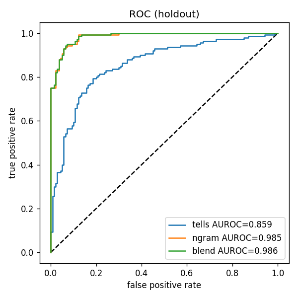
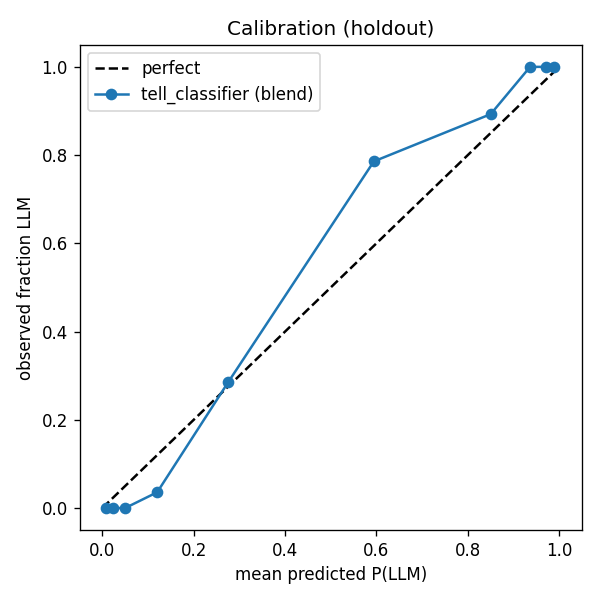
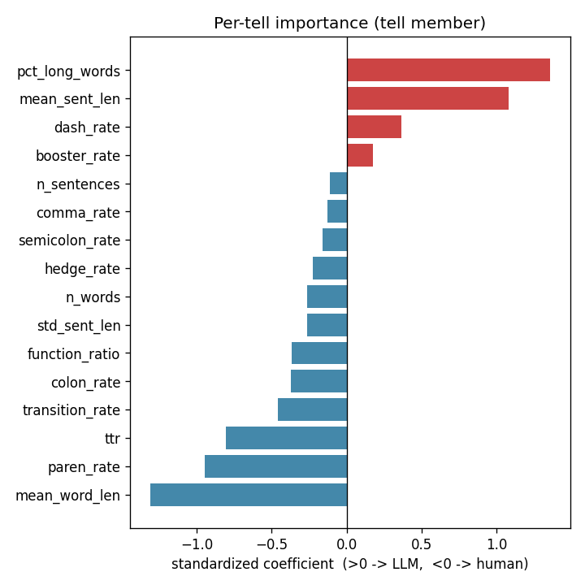
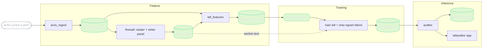
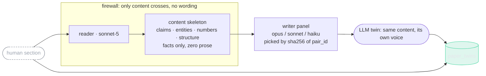
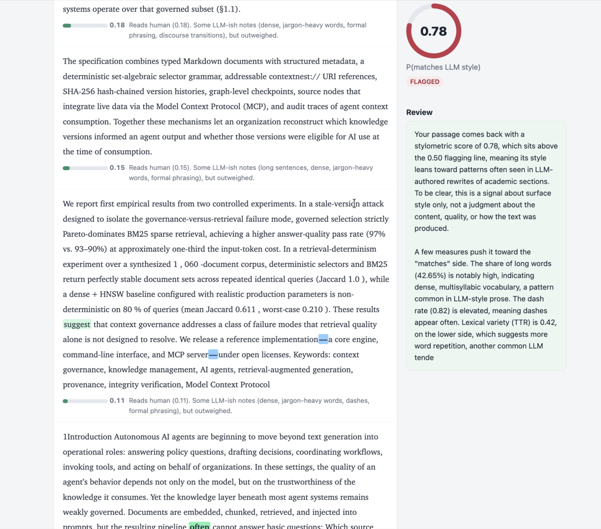

# LLM Tell Auditor


[](https://github.com/MagicLex/awesome-ml-systems)
[](https://www.hopsworks.ai/)

Does a passage of academic prose read like it was written by an LLM, from its
**style alone**? This scores any text, or any arXiv preprint, for how closely its
writing matches LLM-authored rewrites of real paper sections, and shows the
evidence: which stylometric tells fired, where, and how much each moved the
score. Held out by paper, it separates human from LLM-authored prose at **ROC-AUC
0.986**.

It reports a **signal, not a verdict**. A high score means the prose resembles a
known LLM writing style, not that the work is AI-generated or that it is bad. A
good paper can be LLM-polished and a weak one handwritten.

## The result

`tell_classifier`, a blend of two calibrated logistic members. The first scores
16 stylometric tells (sentence and word length distributions, lexical diversity,
punctuation and function-word rates, hedges, boosters, transitions) and supplies
every per-tell explanation in the app. The second is a TF-IDF over character
3-5 grams, the standard authorship-attribution representation, and supplies most
of the discriminative power. Trained on content-controlled rewrite-pairs: each
human arXiv section paired with an LLM twin that carries the same content in a
different voice, so the model learns style, not topic. The split is grouped by
`paper_id`, never by pair or row, so no paper appears on both sides: with
char-ngrams a looser split would let the model memorize each paper's vocabulary
and inflate the number.

| metric (holdout: 17 papers, 140 pairs) | value |
|---|---:|
| ROC-AUC, blend | **0.986** |
| ROC-AUC, char-ngram member alone | 0.985 |
| ROC-AUC, 16-tell member alone | 0.858 |
| precision / recall | 0.95 / 0.89 |
| brier score | 0.054 |
| blind baseline | 0.50 |





Top tells by standardized weight: LLM-style prose runs longer and denser
sentences, more polysyllabic words, lower lexical diversity, and fewer
parenthetical asides. A coherent stylometric signature, not a wordlist. Naive
surface tells (em-dash counts, "moreover") fire near zero on careful LLM academic
prose, which is why the model is distributional.

## Caveats

Read these before quoting the number anywhere.

- **The label is LLM-authored, strong form.** Twins are written from a prose-free
  content skeleton, so they are fully machine-authored, not lightly LLM-polished
  human drafts. The score measures resemblance to that authored distribution.
- **Within-provider.** The writer panel is one provider (Anthropic: opus, sonnet,
  haiku), so this is a within-provider fingerprint, not a universal LLM detector.
- **Style is not quality, and not authorship.** The model never judges the ideas.
  A high score is a style match, never proof anyone used AI.
- **Non-native English is over-flagged by naive detectors.** This is why the app
  publishes evidence per passage rather than a verdict.
- **Arms race.** Once a tell is public it gets corrected, so metrics decay.

## Architecture

An FTI (feature, training, inference) system on Hopsworks. Feature extraction is
one shared, pure function so training and serving cannot skew.



The rewrite-pair firewall is the core F design. A reader agent extracts a
prose-free content skeleton (every claim, number, entity, no wording); a naive
writer that never sees the original writes the twin from the skeleton alone.
Content is held, only style is swapped, so the classifier cannot cheat on topic.



The writer is a within-provider panel (three model sizes leave three different
fingerprints, so the classifier learns LLM-ness, not one model's tics). Sampling
params are fixed on these models, so panel diversity comes from model identity,
assigned deterministically by `pair_id`: reproducible, no RNG.

The file-by-file map:

```
arxiv_ingest.py          fetch arXiv LaTeX source, parse to clean prose per section
ingest_to_fg.py          F1  sections -> arxiv_papers_raw               (terminal/job)
firewall_api.py          reader + writer-panel firewall (Anthropic SDK)
generate_twins_job.py    F2  human sections -> paper_twins              (Hopsworks job)
tell_features.py         shared, pure: prose -> 16 stylometric tells + highlighter
build_tells.py           F3  human + twin -> paper_tells (label)        (Hopsworks job)
train_classifier.py      T   feature view -> tell_classifier -> registry (Hopsworks job)
auditor.py               I   score a paper/passage, attribute per-tell contributions
explain.py               I   plain-language feedback (Anthropic), signal not verdict
audit_job.py             I   audit recent arXiv -> paper_dossiers        (Hopsworks job)
deploy_job.py            register the audit job
app/server.py            server-rendered review app: live scoring + streamed feedback
app/deploy_app.py        deploy the app
```

## Reproduce

Clone into a Hopsworks project on the `/hopsfs/...` FUSE mount. Paths self-derive.
The Anthropic key lives in a project secret (`ANTHROPIC_API_KEY`), never in the
repo.

```bash
python ingest_to_fg.py --per-category 8   # F1  arxiv_papers_raw
python deploy_job.py                        # register the audit job (I)
hops job run gen-twins --args "--max-workers 8"   # F2  paper_twins
hops job run build-tells                    # F3  paper_tells
hops job run train-tells                    # T   tell_classifier
hops job run audit-dossiers --args "--per-category 8"   # I  paper_dossiers
python app/deploy_app.py                     # the review app
```

The two expensive datasets are snapshotted in the repo so a rebuild can skip
F1 and F2 (the twin generation costs ~0.02 USD per pair in Anthropic calls):
`assets/arxiv_papers_raw.parquet` (785 human sections) and
`assets/paper_twins.parquet` (738 rewrite twins). Insert them into their
feature groups and start at `build-tells`.

## The demo



`tellauditor`, a two-pane review. Paste any prose or an arXiv id: the document
renders on the left with stabilo highlights on the token-level tells (marker
brightness scales with how much each moved the score, a scan-line sweeps while it
checks), and a sticky score rail on the right streams a plain-language review.
The score comes from the ML model; the written review only explains it, signal
not verdict. Content is in the initial HTML payload, so it works without
JavaScript; the streaming and animation are progressive enhancement.
